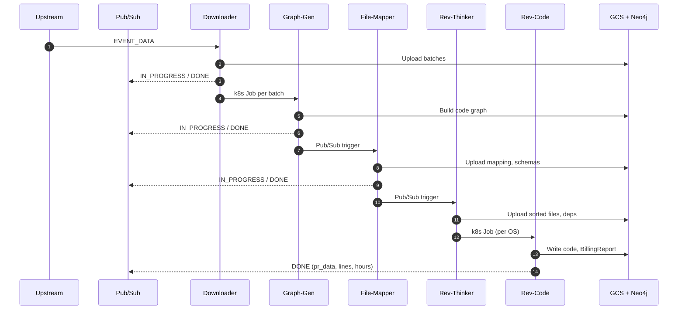
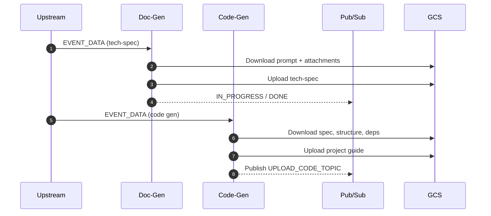
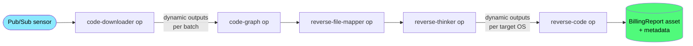

# Running Blitzy Jobs<br/>Through Dagster

<div class="text-cyan-300 text-xl mt-4">
Orchestrating the <code>archie-job-*</code> fleet
</div>

<div class="mt-8 text-sm opacity-60">
mohammed@blitzy.com &middot; 2026-04-22
</div>

<style>
/* ===== global deck styles (match reveal.js black theme) ===== */
:root {
  --slidev-theme-primary: #8be9fd;
}
.slidev-layout {
  background-color: #191919;
  color: #f8f8f2;
  font-family: 'Inter', -apple-system, BlinkMacSystemFont, sans-serif;
}
.slidev-layout h1,
.slidev-layout h2,
.slidev-layout h3,
.slidev-layout h4 {
  color: #f8f8f2;
  letter-spacing: 0;
  text-transform: none;
}
.slidev-layout h1 { color: #f8f8f2; }
.slidev-layout h2 { color: #8be9fd; font-weight: 600; }
.slidev-layout h3 { color: #8be9fd; }
.slidev-layout a { color: #8be9fd; }
.slidev-layout strong { color: #f8f8f2; }
.slidev-layout em { color: #f1fa8c; font-style: italic; }
.slidev-layout :not(pre) > code {
  background-color: #2a2a2a;
  color: #8be9fd;
  padding: 0.1em 0.35em;
  border-radius: 3px;
  font-size: 0.9em;
}
.slidev-layout pre,
.slidev-layout .shiki {
  background-color: #1a1a1a !important;
  border: 1px solid #333;
  border-radius: 6px;
  padding: 0.8em 1em;
  font-size: 0.75em;
  line-height: 1.4;
}
.slidev-layout table {
  border-collapse: collapse;
  border: 1px solid #444;
  width: 100%;
  font-size: 0.8em;
}
.slidev-layout th,
.slidev-layout td {
  border: 1px solid #444;
  padding: 6px 10px;
  text-align: left;
}
.slidev-layout th {
  background: #222;
  color: #8be9fd;
  font-weight: 600;
}
.slidev-layout tr:last-child td { border-bottom: 1px solid #444; }
.slidev-layout blockquote {
  background: #1e2a3a;
  border-left: 4px solid #8be9fd;
  padding: 0.6em 1em;
  color: #f8f8f2;
  font-style: normal;
  border-radius: 0 6px 6px 0;
}
.slidev-layout ul, .slidev-layout ol { line-height: 1.5; }
.slidev-layout .accent { color: #8be9fd; }
.slidev-layout .good { color: #50fa7b; }
.slidev-layout .mid { color: #f1fa8c; }
.slidev-layout .bad { color: #ff6b6b; }

.slidev-layout .callout { background: #1e2a3a; border-left: 4px solid #8be9fd; padding: 0.6em 1em; border-radius: 0 6px 6px 0; }
.slidev-layout .flow-ascii { font-family: 'JetBrains Mono', monospace; font-size: 0.7em; background: #1a1a1a; padding: 0.8em; border-radius: 6px; line-height: 1.8; }

/* ai-flow hand-rolled diagram */
.ai-flow { display: flex; flex-direction: column; align-items: center; gap: 0.25em; margin: 0.25em auto; font-size: 0.58em; }
.ai-flow .ai-node { border-radius: 7px; padding: 0.5em 1em; text-align: center; background: #fff; color: #000; border: 2px solid #555; min-width: 220px; line-height: 1.25; }
.ai-flow .ai-node .t { font-weight: 700; display: block; font-size: 1em; }
.ai-flow .ai-node .s { display: block; font-size: 0.8em; opacity: 0.82; margin-top: 0.1em; }
.ai-flow .ai-node-dark { background: #2b2b2b; color: #fff; border-color: #666; min-width: 170px; }
.ai-flow .ai-node-cyan { background: #8be9fd; border: 3px solid #2aa; }
.ai-flow .ai-node-green { background: #50fa7b; border: 3px solid #2a7; }
.ai-flow .ai-node-pale { background: #fff8dc; border-color: #999; min-width: 140px; padding: 0.45em 0.7em; }
.ai-flow .ai-arrow { font-size: 1.2em; color: #8be9fd; line-height: 1; }
.ai-flow .ai-fanout { display: flex; gap: 0.6em; justify-content: center; }
.ai-flow .ai-fanout-arrows { display: flex; gap: 0.6em; justify-content: center; }
.ai-flow .ai-fanout-arrows .ai-arrow { width: 140px; text-align: center; }

/* phase number badges */
.phase-num { display: inline-block; background: #8be9fd; color: #000; border-radius: 50%; width: 1.6em; height: 1.6em; line-height: 1.6em; text-align: center; font-weight: 600; margin-right: 0.4em; font-family: 'Inter', sans-serif; font-size: 0.85em; }
</style>

---
layout: default
---

# Agenda

<div class="grid grid-cols-3 gap-x-6 gap-y-3 text-sm mt-4">

<div>
  <div class="text-cyan-300 uppercase tracking-wider text-xs font-semibold mb-1">Where we are</div>
  <ol class="list-decimal list-inside leading-tight space-y-0.5">
    <li>Project status</li>
    <li>Current state — seven jobs</li>
    <li>Current flow — sequences</li>
  </ol>
</div>

<div>
  <div class="text-cyan-300 uppercase tracking-wider text-xs font-semibold mb-1">Why change</div>
  <ol start="4" class="list-decimal list-inside leading-tight space-y-0.5">
    <li>Why a workflow engine?</li>
    <li>Modern engine features</li>
    <li>Core primitives</li>
  </ol>
</div>

<div>
  <div class="text-cyan-300 uppercase tracking-wider text-xs font-semibold mb-1">Capabilities</div>
  <ol start="7" class="list-decimal list-inside leading-tight space-y-0.5">
    <li>Built-in operations</li>
    <li>Job tracking &amp; visibility</li>
    <li>Metrics — tokens, %LOC</li>
  </ol>
</div>

<div>
  <div class="text-cyan-300 uppercase tracking-wider text-xs font-semibold mb-1">Tool ranking</div>
  <ol start="10" class="list-decimal list-inside leading-tight space-y-0.5">
    <li>Dagster vs Airflow 3</li>
    <li>Handling large job loads</li>
    <li>Argo Workflows</li>
    <li>Ranked for Blitzy</li>
  </ol>
</div>

<div>
  <div class="text-cyan-300 uppercase tracking-wider text-xs font-semibold mb-1">Context</div>
  <ol start="14" class="list-decimal list-inside leading-tight space-y-0.5">
    <li>Multi-env deployment</li>
    <li>Other options on the market</li>
  </ol>
</div>

<div>
  <div class="text-cyan-300 uppercase tracking-wider text-xs font-semibold mb-1">Path forward</div>
  <ol start="16" class="list-decimal list-inside leading-tight space-y-0.5">
    <li>Phased implementation plan</li>
    <li>AI-augmented operations</li>
  </ol>
</div>

</div>

---
layout: default
---

# Project status — what's done

<div class="grid grid-cols-2 gap-10 mt-6 text-sm">

<div>
  <h3 class="text-green-400 text-lg font-semibold mb-2">✅ Investigation</h3>
  <ul class="list-disc list-inside leading-relaxed space-y-1">
    <li>Seven <code>archie-job-*</code> services mapped</li>
    <li>Tracker audited — ~40% is generic plumbing</li>
    <li>Three-way tool comparison done</li>
    <li>Multi-env claim verified</li>
    <li>AI-integration landscape surveyed</li>
  </ul>
</div>

<div>
  <h3 class="text-green-400 text-lg font-semibold mb-2">✅ Plan</h3>
  <ul class="list-disc list-inside leading-relaxed space-y-1">
    <li>7-phase rollout (starts with <code>code-downloader</code>)</li>
    <li>Local dev: capture → replay → verify</li>
    <li>Six bootstrap prompts for Claude Code</li>
    <li>AI-Phase A–E roadmap</li>
  </ul>
</div>

</div>

<div class="text-center mt-8 text-cyan-300 italic text-sm">
Analysis complete: defensible ranking, scoped Phase 1, replay loop to validate.
</div>

---
layout: default
---

# Project status — what's next

<div class="grid grid-cols-2 gap-10 mt-4 text-sm">

<div>
  <h3 class="text-yellow-300 text-lg font-semibold mb-2">🟡 Decisions pending</h3>
  <ul class="list-disc list-inside leading-relaxed space-y-1">
    <li><strong>Dagster+ vs OSS</strong> — Branch Deployments are Dagster+-only</li>
    <li><strong>PoC owner</strong> — platform team or dedicated workstream?</li>
    <li><strong>Parallel Airflow 3 PoC?</strong></li>
    <li><strong>Scope of jobtracker rebuild</strong> — thin vs analytics</li>
  </ul>
  <h3 class="text-red-400 text-lg font-semibold mt-4 mb-2">🔴 Risks tracked</h3>
  <ul class="list-disc list-inside leading-relaxed space-y-1">
    <li>Long-running jobs vs k8s Pod budgets</li>
    <li>Control-plane cost vs current Cloud Run</li>
    <li>Airflow 3 momentum may flip ranking in ~12 months</li>
  </ul>
</div>

<div>
  <h3 class="text-green-400 text-lg font-semibold mb-2">🎯 Next decision gate</h3>
  <ul class="list-disc list-inside leading-relaxed space-y-1">
    <li><strong>Phase 1 exit review</strong> — 2 weeks after kickoff</li>
    <li>Demo: <code>code-downloader</code> under Dagster w/ metadata visible</li>
    <li>Go / no-go for Phase 2</li>
  </ul>
</div>

</div>

<blockquote class="mt-4 text-sm">
<strong>Today's ask:</strong> align on ranking (Dagster &gt; Airflow 3 &gt; Argo), approve the phased plan, pick Dagster+ vs OSS + a PoC owner so Phase 1 can start.
</blockquote>

---
layout: default
---

# Today's job fleet

| Job | Next hop | Runtime |
|---|---|---|
| archie-job-code-downloader | Pub/Sub → code-graph OR k8s Job | Cloud Run Job |
| archie-job-code-graph-generator | Pub/Sub → reverse-file-mapper | Cloud Run / k8s |
| archie-job-document-generator | Pub/Sub tech-spec events | Cloud Run Job |
| archie-job-reverse-file-mapper | Pub/Sub → reverse-thinking | Cloud Run Job |
| archie-job-reverse-thinking-generator | k8s Job → reverse-code (per OS) | Cloud Run → k8s |
| archie-job-reverse-code-generator | Emits billing report + PR data | Cloud Run / k8s |
| archie-job-code-generator | Pub/Sub → upload topic | Cloud Run Job |

---
layout: default
---

# How they chain today

<div class="flow-ascii">
code-downloader ──► code-graph-generator ──► reverse-file-mapper<br/>
&nbsp;&nbsp;&nbsp;&nbsp;&nbsp;&nbsp;&nbsp;&nbsp;&nbsp;└─► (batches, per-OS)&nbsp;&nbsp;&nbsp;&nbsp;│<br/>
&nbsp;&nbsp;&nbsp;&nbsp;&nbsp;&nbsp;&nbsp;&nbsp;&nbsp;&nbsp;&nbsp;&nbsp;&nbsp;&nbsp;&nbsp;&nbsp;&nbsp;&nbsp;&nbsp;&nbsp;&nbsp;&nbsp;&nbsp;&nbsp;&nbsp;&nbsp;&nbsp;&nbsp;&nbsp;&nbsp;&nbsp;&nbsp;&nbsp;&nbsp;&nbsp;&nbsp;&nbsp;&nbsp;&nbsp;&nbsp;&nbsp;&nbsp;&nbsp;&nbsp;▼<br/>
document-generator ──(independent)──► reverse-thinking-generator<br/>
&nbsp;&nbsp;&nbsp;&nbsp;&nbsp;&nbsp;&nbsp;&nbsp;&nbsp;&nbsp;&nbsp;&nbsp;&nbsp;&nbsp;&nbsp;&nbsp;&nbsp;&nbsp;&nbsp;&nbsp;&nbsp;&nbsp;&nbsp;&nbsp;&nbsp;&nbsp;&nbsp;&nbsp;&nbsp;&nbsp;&nbsp;&nbsp;&nbsp;&nbsp;&nbsp;&nbsp;&nbsp;&nbsp;&nbsp;&nbsp;&nbsp;&nbsp;&nbsp;&nbsp;&nbsp;&nbsp;&nbsp;&nbsp;&nbsp;&nbsp;&nbsp;&nbsp;&nbsp;&nbsp;▼<br/>
&nbsp;&nbsp;&nbsp;&nbsp;&nbsp;&nbsp;&nbsp;&nbsp;&nbsp;&nbsp;&nbsp;&nbsp;&nbsp;&nbsp;&nbsp;&nbsp;&nbsp;&nbsp;&nbsp;&nbsp;&nbsp;&nbsp;&nbsp;&nbsp;&nbsp;&nbsp;&nbsp;&nbsp;&nbsp;&nbsp;&nbsp;&nbsp;&nbsp;&nbsp;&nbsp;&nbsp;&nbsp;&nbsp;&nbsp;&nbsp;&nbsp;&nbsp;&nbsp;&nbsp;&nbsp;&nbsp;&nbsp;&nbsp;&nbsp;reverse-code-generator (+ billing)<br/>
code-generator ──► upload topic (separate branch)
</div>

<div class="text-sm mt-3 opacity-80">
Topology is implicit — it lives across seven <code>publish_notification(...)</code> and <code>submit_kubernetes_job(...)</code> calls. No central DAG.
</div>

---
layout: default
---

# What the jobs share

<div class="text-sm">

- Entry point: `python main.py` reading `EVENT_DATA` JSON env var
- Internal logic: LangGraph `StateGraph` with async streaming
- Status: Pub/Sub events to `PLATFORM_EVENTS_TOPIC` (`IN_PROGRESS`/`DONE`/`FAILED`)
- Tracing: LangSmith (`LANGSMITH_*` env)
- Storage: GCS via `AdminStorageService`, Neo4j via `CodeGraphBuilder`
- Retry: `@archie_exponential_retry` re-implemented per repo; Cloud Run `--max-retries 0`
- Deploy: GitHub Actions → `gcloud run jobs deploy`, hardcoded `_DEV`

</div>

---
layout: default
---

# Current job flow — sequence

<div class="text-sm opacity-80 mb-2">
A "full build" today spans five services, two fan-outs, Pub/Sub hops, and one self-submitted k8s Job. No run-id ties them together.
</div>



---
layout: default
---

# Independent branches

<div class="text-sm opacity-80 mb-2">
Two pipelines don't join the chain above:
</div>



<div class="text-sm mt-2 opacity-80">
Both emit the same status-event schema but are triggered from different upstream services; topology must be reconstructed from the payloads.
</div>

---
layout: default
---

# What's missing

<div class="text-sm">

- <span class="bad">No single run-id</span> — status events only correlate via `job_id` / `code_gen_id`
- <span class="bad">Two fan-out shapes</span> — batch (downloader→graph) and OS (thinker→code) are hand-rolled
- <span class="bad">Chain knowledge lives in code</span> — seven `publish_notification` / `submit_kubernetes_job` call-sites
- <span class="bad">Independent jobs aren't visible together</span> — document-generator + code-generator are their own pipelines
- <span class="bad">No retry coordination</span> — each service has its own exponential-retry helper

</div>

<div class="text-green-400 text-sm mt-3">
Every one of these becomes a Dagster primitive: run, dynamic output, job, sensor, RetryPolicy.
</div>

---
layout: default
---

# Same flow under Dagster

<div class="text-sm opacity-80 mb-2">
One run, one id, visible gantt, resumable from any failed op.
</div>



---
layout: default
---

# Why a workflow engine? — runtime debts

<div class="text-sm opacity-80 mb-2">
Technical debts with citations — not hypotheticals. Part 1 of 2.
</div>

<div class="text-sm">

1. **Implicit state machine as a mutable list.** `reverse-code-generator/main.py:380` — `stage_tracker = ["CODE_GENERATION"]` shared mutably with the helper so failure notifications can report the right stage.
2. **Import blocked without prod credentials.** Every `main.py` calls `storage.Client()`, `pubsub_v1.PublisherClient()`, and 15+ `os.environ[...]` reads at module load (e.g. `document-generator/main.py:24-40`). Nothing is unit-testable in isolation.
3. **Batch fan-in implemented as a Neo4j query.** `code-graph-generator/main.py:211-217` — `if graph_builder.are_other_batches_complete(...)` decides when to emit the next-stage trigger. Coordination logic lives in the graph database.
4. **Mid-run k8s submission hides the fan-out.** `reverse-thinking-generator/main.py:220-244` submits `REVERSE_CODE_GENERATOR` / `_WINDOWS` per target OS via a bare function call — never visible in any DAG view.

</div>

---
layout: default
---

# Why a workflow engine? — consistency debts

<div class="text-sm opacity-80 mb-2">
Part 2 of 2 — issues that compound every time a new job is added.
</div>

<div class="text-sm">

5. **Retry policy duplicated seven times.** `@archie_exponential_retry` imported in every repo (e.g. `code-downloader/main.py:508`). Seven back-off curves to keep in sync.
6. **Cross-job topology lives in Pub/Sub call-sites.** `reverse-file-mapper/main.py:217` publishes to `GENERATE_REVERSE_THINKING_TOPIC`. The pipeline's shape is distributed across string literals in seven files.
7. **Event schema is implicit.** Every job reads `event_data.get("tech_spec_id", "")`, `event_data.get("propagate", True)`. The `EVENT_DATA` contract is documented nowhere and drifts silently across repos.

</div>

<blockquote class="mt-4 text-sm">
<strong>Total:</strong> seven distinct anti-patterns, each with a named location in the code. None are hypothetical.
</blockquote>

---
layout: default
---

# Modern playbook — the data layer

<div class="text-sm opacity-80 mb-3">
"Workflow engine" used to mean cron + task DAG. Modern engines (Dagster, Airflow 3, Prefect 3, Flyte) ship a richer set of primitives.
</div>

<div class="grid grid-cols-3 gap-4 text-sm">

<div class="callout">
  <h3 class="text-green-400 font-semibold mb-2">Data-aware</h3>
  <ul class="list-disc list-inside space-y-1">
    <li><strong>Assets</strong> as first-class outputs</li>
    <li><strong>Typed I/O + I/O managers</strong></li>
    <li><strong>Lineage &amp; freshness</strong> policies</li>
  </ul>
</div>

<div class="callout">
  <h3 class="text-green-400 font-semibold mb-2">Event-driven</h3>
  <ul class="list-disc list-inside space-y-1">
    <li><strong>Sensors</strong> — Pub/Sub, GCS, asset triggers</li>
    <li><strong>Dynamic outputs</strong> — fan-out native</li>
    <li><strong>Asset-based scheduling</strong></li>
  </ul>
</div>

<div class="callout">
  <h3 class="text-green-400 font-semibold mb-2">Observable</h3>
  <ul class="list-disc list-inside space-y-1">
    <li><strong>Structured metadata</strong> — tokens, %LOC, $</li>
    <li><strong>Modern UI</strong> — asset graph + Gantt + logs</li>
    <li><strong>GraphQL / REST API</strong> for dashboards</li>
  </ul>
</div>

</div>

---
layout: default
---

# Modern playbook — build & operate

<div class="text-sm opacity-80 mb-3">
The same primitives apply to how you ship, run, and extend the pipeline.
</div>

<div class="grid grid-cols-3 gap-4 text-sm">

<div class="callout">
  <h3 class="text-green-400 font-semibold mb-2">Composable</h3>
  <ul class="list-disc list-inside space-y-1">
    <li><strong>Typed resources</strong> — env-aware deps per op</li>
    <li><strong>Hot reload / code locations</strong></li>
    <li><strong>Native integrations</strong> — k8s, dbt, LLM APIs</li>
  </ul>
</div>

<div class="callout">
  <h3 class="text-green-400 font-semibold mb-2">Operable</h3>
  <ul class="list-disc list-inside space-y-1">
    <li><strong>Retry policies</strong> — typed, visible in UI</li>
    <li><strong>Partial reruns</strong> from a failed step</li>
    <li><strong>Backfills + partitions</strong></li>
  </ul>
</div>

<div class="callout">
  <h3 class="text-green-400 font-semibold mb-2">AI-ready</h3>
  <ul class="list-disc list-inside space-y-1">
    <li><strong>Hooks</strong> — triage, alerting, audit</li>
    <li><strong>Structured events</strong> — LLM-consumable</li>
    <li><strong>Branch / PR envs</strong> — test AI automations</li>
  </ul>
</div>

</div>

---
layout: default
---

# Old vs new — orchestration primitives

| Need | Today (custom) | Modern engine |
|---|---|---|
| Run 7 jobs in order | Hand-coded `publish_notification` + `submit_kubernetes_job` across seven repos | One `@job` definition; topology is diffable |
| Fan out per batch / per OS | Hardcoded `BATCH_INDEX_JOB_TYPES`; bespoke Neo4j check | `DynamicOutput` — native primitive |
| Correlate a multi-job build | Reassemble from Pub/Sub events via `job_id` / `code_gen_id` | One `run_id` spans the whole pipeline |
| Retry a specific step | Not supported — all-or-nothing retrigger | One-click partial rerun from UI or API |
| Status freshness | Polling Cloud Run / k8s APIs every cycle | Push events from the engine |

<div class="text-green-400 text-sm mt-3">
Every "today" column is work we already own. Every "modern engine" column is built-in.
</div>

---
layout: default
---

# Old vs new — metadata & developer experience

| Need | Today (custom) | Modern engine |
|---|---|---|
| Track tokens / %LOC / $ | Custom `BillingReport` JSON in GCS + tracker DB columns | `MetadataValue` on the run; auto-rendered in UI |
| Trigger from an event | Tracker exposes `POST /v1/job/{id}/trigger` | `@sensor` or `launchRun` GraphQL — built-in |
| Add a new job | New repo, new `ArchieJobType` enum, tracker mapping, GitHub Action | One `@op` added to a `@job` |
| Local reproduction | Requires GCP + Neo4j + LangSmith creds to *import* | `dagster dev` with mock resources |
| AI triage on failure | Would need a microservice on top of Pub/Sub | One `@failure_hook` decorator |

<blockquote class="mt-3 text-sm">
<strong>Total across both slides:</strong> ten places the engine gives us "built-in" what we've built (or would need to build) by hand.
</blockquote>

---
layout: default
---

# What "modern" actually unlocks

<div class="text-sm">

- **New jobs cost less.** Adding a job is one `@op`, not a new repo + GitHub Action + tracker enum entry + dashboard filter.
- **Complex flows become representable.** Conditional branches, dynamic fan-out, asset freshness — all first-class, not custom code.
- **The tracker rebuild is smaller.** ~40% of backend retires; the remaining Blitzy-specific dashboards get cleaner data from GraphQL.
- **AI automation becomes trivial.** The triage hook is a decorator, not a microservice.
- **Multi-env becomes a config file**, not seven GitHub Actions workflows × three envs.
- **Onboarding speeds up.** A new engineer reads one `Definitions` file instead of tracing Pub/Sub topics across seven repos.

</div>

<blockquote class="mt-3 text-sm">
<strong>The cost of <em>not</em> changing</strong> is that every one of these is a custom system we build and maintain — and the tracker audit shows we're already doing exactly that.
</blockquote>

---
layout: default
---

# Core primitives

<div class="text-sm opacity-80 mb-3">
Workflow engines have three small vocabularies. Learn these and the rest is plumbing.
</div>

<div class="grid grid-cols-3 gap-4 text-sm">

<div class="callout">
  <h3 class="text-green-400 font-semibold mb-2">Op / operator</h3>
  <p><strong>A unit of work.</strong> Takes inputs, produces outputs, has config &amp; retries.</p>
  <p class="text-xs mt-2 opacity-70">Airflow: <code>BashOperator</code>, <code>PostgresOperator</code>, <code>KubernetesPodOperator</code></p>
  <p class="text-xs opacity-70">Dagster: <code>@op</code>, <code>k8s_job_op</code>, <code>shell_op</code></p>
</div>

<div class="callout">
  <h3 class="text-green-400 font-semibold mb-2">Sensor</h3>
  <p><strong>An event-driven trigger.</strong> Polls or subscribes to external signals; fires a run when something happens.</p>
  <p class="text-xs mt-2 opacity-70">e.g. Pub/Sub message, new GCS object, upstream asset refreshed</p>
</div>

<div class="callout">
  <h3 class="text-green-400 font-semibold mb-2">Schedule</h3>
  <p><strong>A time-driven trigger.</strong> Cron expression → launches a run.</p>
  <p class="text-xs mt-2 opacity-70">Complementary to sensors, not a replacement</p>
</div>

</div>

<div class="text-sm mt-3">
Ops are the <em>verbs</em> of the pipeline. Sensors &amp; schedules are the <em>triggers</em>. A "job" wires ops together; a "run" is one execution of a job.
</div>

---
layout: default
---

# What an op looks like

<div class="grid grid-cols-2 gap-4 text-sm">

<div>
<h3 class="mb-1">Airflow operator</h3>

```python
from airflow.operators.bash import BashOperator

run_etl = BashOperator(
    task_id="run_etl",
    bash_command="python etl.py",
    retries=3,
    retry_delay=timedelta(minutes=5),
)
```

<div class="text-xs opacity-70 mt-1">
Operator = instantiated Python class. Connections &amp; config live outside the code.
</div>
</div>

<div>
<h3 class="mb-1">Dagster op</h3>

```python
from dagster import op, RetryPolicy

@op(retry_policy=RetryPolicy(max_retries=3, delay=300))
def run_etl(context, raw_data: dict) -> dict:
    context.log.info("processing %d rows", len(raw_data))
    return transform(raw_data)
```

<div class="text-xs opacity-70 mt-1">
Op = plain decorated Python function. Typed inputs/outputs. Resources injected, not imported.
</div>
</div>

</div>

<blockquote class="mt-3 text-sm">
Key idea in both: <strong>the engine owns retries, logging, status</strong> — you write the work, not the orchestration boilerplate.
</blockquote>

---
layout: default
---

# What a sensor looks like

```python
from dagster import sensor, RunRequest, SkipReason

@sensor(job=archie_full_build, minimum_interval_seconds=30)
def on_new_build_event(context):
    cursor = context.cursor or "0"
    messages = pubsub.pull(subscription="dev-archie-triggers",
                           ack_deadline=0,  # peek, don't commit
                           start=cursor)
    if not messages:
        return SkipReason("no new events")

    for msg in messages:
        yield RunRequest(
            run_key=msg.message_id,           # de-dupe
            run_config={"ops": {"download_code":
                {"config": {"event_data": msg.data.decode()}}}},
            tags={"company_id": msg.attributes["company_id"]},
        )
    context.update_cursor(messages[-1].publish_time)
```

<div class="text-sm mt-2">

- **Stateful** — the cursor remembers what's been processed
- **De-duplicated** — `run_key` prevents double-launches on retries
- **Tagged** — tags flow onto every run for filtering &amp; billing

</div>

---
layout: default
---

# How they fit Blitzy

| Today | In Dagster |
|---|---|
| Upstream service publishes `EVENT_DATA` to a Pub/Sub topic | **Sensor** watches the topic, launches a run with the payload |
| `archie-job-code-downloader` Cloud Run Job | **Op** (`k8s_job_op` in Phase 1, native `@op` later) |
| Downloader publishes to `GRAPH_CODE_TOPIC` to chain graph-generator | **Direct dependency** inside the same job — no extra hop |
| Self-submitted k8s Job (per-OS fan-out in reverse-thinker) | **Dynamic outputs** → one op instance per OS |
| Cron or manual "rerun all repos for company X" | **Schedule** or **backfill** over an asset partition |
| No trigger for "re-run when tech-spec changed" | **Asset sensor** on the `tech_spec` asset |

<div class="text-green-400 text-sm mt-3">
Four primitives — op, sensor, schedule, asset — cover everything the current seven-service chain does, plus the two triggers it doesn't have today.
</div>

---
layout: default
---

# Built-in operations

<div class="text-sm opacity-80 mb-2">
Airflow's "operators" vs Dagster's "ops + resources":
</div>

| Capability | Airflow | Dagster |
|---|---|---|
| Shell command | BashOperator | shell_op (dagster-shell) |
| k8s Pod | KubernetesPodOperator | k8s_job_op (dagster-k8s) |
| Postgres / MySQL | PostgresOperator, hooks | dagster-postgres resource |
| Snowflake / BigQuery | Providers | dagster-snowflake / -bigquery |
| dbt | DbtRunOperator | dagster-dbt (first-class assets) |
| HTTP | SimpleHttpOperator | Plain Python op + resource |
| Pub/Sub / GCS | Google providers | dagster-gcp |
| Sensors | Many built-ins | `@sensor` + helpers |
| Branching | BranchPythonOperator | Dynamic outputs / conditional assets |

<div class="text-sm mt-3">
<span class="mid">Bottom line:</span> Airflow's catalog is wider. Dagster closes the gap with typed Python, so you write less YAML glue.
</div>

---
layout: default
---

# For Blitzy specifically

<div class="text-sm opacity-80 mb-2">
The migration mainly uses four primitives — nothing exotic.
</div>

<div class="text-sm">

- `k8s_job_op` — run the existing Docker images unchanged
- Thin `@op` wrappers — preserve the `main.py` entry points
- `dagster-gcp` — Pub/Sub, GCS, Artifact Registry
- Custom LangSmith resource — central place for tracing + token pulls

</div>

<div class="text-green-400 text-sm mt-3">
The jobs themselves don't have to change to get orchestrated.
</div>

---
layout: default
---

# Job tracking & visibility

<div class="text-sm opacity-80 mb-2">
Out-of-the-box from the Dagster UI:
</div>

<div class="text-sm">

- **Runs page** — every trigger → one run, gantt of ops, full logs
- **Asset graph** — tech-spec, code-graph, reverse-code PR shown as nodes
- **Per-op metadata** — typed (int, float, url, markdown) on each step
- **One-click retries** from the failed step
- **Backfills** — re-materialize ranges (e.g. all repos for a company)
- **Timeline view** across runs — trend durations, spot regressions
- **Run tags** — filter by env, company_id, job_type

</div>

---
layout: default
---

# One run-id for the whole pipeline

<div class="text-sm">
Today you reconstruct a build from Pub/Sub events with <code>job_id</code>, <code>project_id</code>, <code>code_gen_id</code>, <code>batch_index</code>. Dagster gives you a single run that owns all of it — parent, children, retries, timings — with no bespoke dashboard needed.
</div>

<blockquote class="mt-4 text-sm">
<strong>Concrete win:</strong> when <code>reverse-thinking-generator</code> fails at hour 3 of a 6-hour build, you re-run from that op while preserving upstream code-graph outputs.
</blockquote>

---
layout: default
---

# Built-in metrics

| Metric | Source | Where it lives |
|---|---|---|
| Step status, duration, start/end | Dagster run events | UI + event log |
| Retry count, failures, error class | Run events | UI + metrics export |
| Asset materializations &amp; freshness | Asset events | Asset catalog |
| CPU / memory per step | K8sRunLauncher + Prometheus | Grafana |
| Tag-based filters (env, company) | Run tags | UI + GraphQL |

---
layout: default
---

# Custom metrics — you already have them

<div class="text-sm opacity-80 mb-2">
Every field the <code>reverse-code</code> notifier emits can become first-class Dagster metadata — no parallel metrics pipeline needed:
</div>

```python
@op
def emit_billing(context, billing: dict):
    context.add_output_metadata({
        "files_touched":  MetadataValue.int(billing["files_modified"]),
        "lines_added":    MetadataValue.int(billing["breakdown"]["additions"]),
        "lines_edited":   MetadataValue.int(billing["breakdown"]["edits"]),
        "lines_removed":  MetadataValue.int(billing["breakdown"]["removals"]),
        "percent_LOC":    MetadataValue.float(billing["percent_loc"]),
        "hours_saved":    MetadataValue.float(billing["hours_saved"]),
        "tokens_input":   MetadataValue.int(billing["tokens"]["input"]),
        "tokens_output":  MetadataValue.int(billing["tokens"]["output"]),
        "cost_usd":       MetadataValue.float(billing["cost_usd"]),
        "langsmith_run":  MetadataValue.url(billing["langsmith_run_url"]),
    })
```

<div class="text-green-400 text-sm mt-2">
All of these appear directly on the run page, are queryable via GraphQL, and can be exported to Datadog / Prometheus.
</div>

---
layout: default
---

# Where today's fields map

<div class="text-sm">

- `files_touched, lines_{added,edited,removed}` → op metadata on reverse-code
- `lines_onboarded, files_onboarded, file_extensions` → op metadata on downloader
- `total_files_processed, total_lines_processed` → asset metadata on code-graph
- `estimated_lines_generated, estimated_hours_saved` → op metadata on document-generator
- `BillingReport` (GCS) → attached as `MetadataValue.path` + inline summary
- LangSmith token counts → pulled via SDK inside the op, attached as metadata

</div>

---
layout: default
---

# Metadata visibility — today

<div class="text-sm opacity-80 mb-3">
What the tracker actually surfaces vs what's hiding in JSONB blobs.
</div>

<div class="grid grid-cols-2 gap-6 text-sm">

<div>
<h3 class="text-green-400 mb-2">Visible in the UI today</h3>
<ul class="list-disc list-inside space-y-1">
  <li>Status, duration, phase, ETA</li>
  <li>User, project, execution-id</li>
  <li>Per-company LOC + hours saved (Sales)</li>
  <li>Retrigger actions, logs + LangSmith links</li>
</ul>
</div>

<div>
<h3 class="text-red-400 mb-2">Hidden in <code>event_data</code> JSONB</h3>
<ul class="list-disc list-inside space-y-1">
  <li><code>company_id</code>, <code>batch_index</code>, <code>team_id</code></li>
  <li>Token counts, cost, model name</li>
  <li><code>files_touched</code>, <code>lines_*</code>, <code>pr_data</code></li>
  <li>Retry count, parent-run, error class</li>
  <li>File-extension histograms</li>
</ul>
</div>

</div>

<blockquote class="mt-4 text-sm">
<strong>Symptom:</strong> company &amp; batch filters run JSONB text scans. No cost-per-PR view. No trend charts. No grouped-incident view.
</blockquote>

---
layout: default
---

# What improved visibility looks like

<div class="text-sm opacity-80 mb-3">
After lifting the hidden fields into first-class metadata:
</div>

<div class="grid grid-cols-2 gap-6 text-sm">

<div>
<h3 class="text-green-400 mb-2">New UI views</h3>
<ul class="list-disc list-inside space-y-1">
  <li><strong>Cost per PR</strong> — Sales metric request</li>
  <li><strong>Tokens per company / day</strong> — billing + forecast</li>
  <li><strong>Retry rate</strong> by job type &amp; error class</li>
  <li><strong>Grouped incidents</strong> — "8 × Neo4j timeout, 2 × rate-limit"</li>
  <li><strong>Week-over-week trends</strong> — duration p95, failure rate</li>
  <li><strong>Parent-run correlation</strong> — the full build as one view</li>
</ul>
</div>

<div>
<h3 class="text-green-400 mb-2">New filters</h3>
<ul class="list-disc list-inside space-y-1">
  <li>Company (indexed UUID, not text scan)</li>
  <li>Error class (NEO4J_TIMEOUT, LLM_RATE_LIMIT, …)</li>
  <li>Retry range (0, 1–2, 3+)</li>
  <li>Cost range ($0–1, $1–5, $5+)</li>
  <li>Batch index (real column, sortable)</li>
</ul>
</div>

</div>

<div class="text-green-400 text-sm mt-3">
Net win: the dashboards people have been asking Sales &amp; Engineering for, without rebuilding the API surface.
</div>

---
layout: default
---

# Metadata — today vs engines

| Need | Tracker today | Airflow 3 | Dagster |
|---|---|---|---|
| Per-step timing | <span class="bad">❌ phase enum only</span> | <span class="good">✅ TaskInstance</span> | <span class="good">✅ op event log</span> |
| Retry count | <span class="mid">⚠ buried in JSONB</span> | <span class="good">✅ `try_number`</span> | <span class="good">✅ RetryPolicy</span> |
| Tokens / $ cost | <span class="mid">⚠ in JSONB</span> | <span class="mid">⚠ XCom (untyped)</span> | <span class="good">✅ `MetadataValue`</span> |
| Parent-child correlation | <span class="bad">❌ none</span> | <span class="mid">⚠ trigger string</span> | <span class="good">✅ tags + asset lineage</span> |
| Error classification | <span class="bad">❌ none</span> | <span class="mid">⚠ log string</span> | <span class="good">✅ hooks → tags</span> |
| Asset lineage | <span class="bad">❌ none</span> | <span class="mid">⚠ new &amp; maturing</span> | <span class="good">✅ native UI</span> |
| Trend charts | <span class="bad">❌ none</span> | <span class="mid">⚠ Grafana add-on</span> | <span class="good">✅ UI + GraphQL</span> |
| Typed UI rendering | <span class="bad">❌ flat strings</span> | <span class="mid">⚠ partial</span> | <span class="good">✅ first-class</span> |

<blockquote class="mt-3 text-sm">
The ask isn't "switch engines to get visibility." It's "capture the right fields first; then the engine (if we adopt one) renders them for free."
</blockquote>

---
layout: default
---

# Metadata improvements — engineering

<div class="text-sm opacity-80 mb-3">
Five quick wins that ship in ~4 weeks, all of which land cleanly in Dagster later (as tags + <code>MetadataValue</code>). No orchestrator dependency.
</div>

| Sub-phase | Work | Effort |
|---|---|---|
| <span class="phase-num">M1</span> | Promote 6 fields to indexed DB columns | 1 week |
| <span class="phase-num">M2</span> | Pydantic `JobEventData` shared schema + backfill | 1 week |
| <span class="phase-num">M3</span> | Token + cost columns (LangSmith post-processor) | 1 week |
| <span class="phase-num">M4</span> | Error classifier (regex map or Haiku hook) | 3 days |
| <span class="phase-num">M5</span> | Materialized view + trend charts in UI | 1 week |

<div class="text-green-400 text-sm mt-3">
Parallelizable with Dagster Phase 1. Engineering ships; orchestration ships; they converge in Phase 6.
</div>

---
layout: default
---

# <span class="phase-num">M1</span> New indexed columns

```sql
ALTER TABLE cloud_run_job_tracker
  ADD COLUMN company_id          UUID,
  ADD COLUMN team_id             UUID,
  ADD COLUMN batch_index         INTEGER,
  ADD COLUMN parent_execution_id TEXT,
  ADD COLUMN retry_count         INTEGER DEFAULT 0,
  ADD COLUMN error_class         TEXT;

CREATE INDEX idx_crjt_company ON cloud_run_job_tracker(company_id);
CREATE INDEX idx_crjt_team    ON cloud_run_job_tracker(team_id);
CREATE INDEX idx_crjt_batch   ON cloud_run_job_tracker(batch_index)
  WHERE batch_index IS NOT NULL;
CREATE INDEX idx_crjt_parent  ON cloud_run_job_tracker(parent_execution_id)
  WHERE parent_execution_id IS NOT NULL;
CREATE INDEX idx_crjt_err     ON cloud_run_job_tracker(error_class)
  WHERE error_class IS NOT NULL;
```

<div class="text-sm mt-2">
Backfill from existing <code>event_data</code> blob via a one-time script. Filters stop hitting JSONB text scans the moment indexes are built.
</div>

---
layout: default
---

# <span class="phase-num">M2</span> Typed event schema

```python
class JobEventData(BaseModel):
    project_id: str
    job_id: str
    user_id: str
    company_id: UUID
    team_id: UUID | None = None
    tech_spec_id: str | None = None
    code_gen_id: str | None = None
    batch_index: int | None = None
    parent_execution_id: str | None = None
    metadata: JobEventMetadata

class JobEventMetadata(BaseModel):
    lines_onboarded: int | None = None
    files_onboarded: int | None = None
    files_touched:   int | None = None
    lines_added:     int | None = None
    lines_edited:    int | None = None
    lines_removed:   int | None = None
    hours_saved:     float | None = None
    percent_complete: float | None = None
    tokens_input:    int | None = None
    tokens_output:   int | None = None
    cost_usd:        float | None = None
    model_name:      str | None = None
    pr_data:         dict | None = None
    file_extensions: dict[str, int] | None = None
```

<div class="text-sm mt-2">
Shared in <code>blitzy-utils</code>. Jobs import &amp; validate; tracker ingestion validates. Fails fast in non-prod; warns in prod.
</div>

---
layout: default
---

# <span class="phase-num">M3</span> Tokens + cost columns

```sql
ALTER TABLE cloud_run_job_tracker
  ADD COLUMN tokens_input  BIGINT,
  ADD COLUMN tokens_output BIGINT,
  ADD COLUMN cost_usd      NUMERIC(10, 4),
  ADD COLUMN model_name    TEXT;
```

<div class="text-sm mt-3">
Populated by a LangSmith post-processor on <code>DONE</code> events — reads the trace, sums input/output tokens per model, applies current pricing.
</div>

<div class="text-sm mt-3">

- Per-run cost visible in the job detail page
- Per-company / per-day rollup on Sales dashboard
- Feeds AI-Phase C's budget guardrail

</div>

---
layout: default
---

# <span class="phase-num">M5</span> Time-series rollup

```sql
CREATE MATERIALIZED VIEW job_rollup_daily AS
SELECT
  date_trunc('day', created_at) AS day,
  job_type, env_type, company_id,
  count(*)                                        AS total_runs,
  count(*) FILTER (WHERE job_status = 'SUCCESS')  AS successes,
  count(*) FILTER (WHERE job_status = 'FAILED')   AS failures,
  avg(EXTRACT(EPOCH FROM (updated_at - created_at)))  AS avg_duration_s,
  percentile_cont(0.95) WITHIN GROUP (ORDER BY
    EXTRACT(EPOCH FROM (updated_at - created_at)))    AS p95_duration_s,
  sum(cost_usd)       AS total_cost_usd,
  sum(tokens_input)   AS total_tokens_input,
  sum(tokens_output)  AS total_tokens_output,
  sum(retry_count)    AS total_retries
FROM cloud_run_job_tracker
GROUP BY 1, 2, 3, 4;
```

<div class="text-sm mt-2">
Refreshed hourly via APScheduler. Replaces hot-path aggregations recomputed per request. Feeds WoW trend charts in the UI.
</div>

---
layout: default
---

# Each column maps cleanly to Dagster

| Quick win | Dagster equivalent |
|---|---|
| Indexed columns (`company_id`, `batch_index`, …) | **Run tags** — indexed, filterable in UI with no backend change |
| Token + cost columns | **`MetadataValue.int() / .float()`** — rendered with currency formatting |
| Pydantic `JobEventData` | **Op config** — Pydantic-validated at run launch |
| Error classifier | **`@failure_hook`** → `run_tags = {"ai.error_class": …}` |
| Materialized rollup view | **GraphQL** against event log — no precomputed view needed |
| Parent-child column | **Asset lineage** — visible in the asset graph UI |

<div class="text-green-400 text-sm mt-3">
<strong>Not throwaway work.</strong> Every M1–M5 change is something Dagster encourages anyway; the migration just reshapes columns into tags and metadata values.
</div>

---
layout: default
---

# Dagster vs Airflow 3 — core model

<div class="text-sm opacity-80 mb-2">
Airflow 3.0 (GA April 2025) narrowed the data-awareness gap. Dagster still leads, but the margin shrank — especially on scheduling and language support.
</div>

| Dimension | Dagster | Airflow 3 |
|---|---|---|
| Core abstraction | Assets + ops | Tasks + <span class="good">Assets (new in 3.0)</span> |
| Scheduling | Cron + sensors + asset freshness | Cron + sensors + <span class="good">data-aware asset scheduling</span> |
| Language | Python only | Python + <span class="good">Task SDK: Go (GA), Java / R (roadmap)</span> |
| Local dev | `dagster dev` zero-infra | Still needs DB + scheduler + webserver |
| Testing | Plain Python ops | DAG test harness; <span class="good">stable authoring API</span> |
| Remote execution | K8sRunLauncher + `k8s_job_op` | <span class="good">Edge Executor + Task SDK</span> |

---
layout: default
---

# Dagster vs Airflow 3 — ecosystem & ops

| Dimension | Dagster | Airflow 3 |
|---|---|---|
| Typed I/O | I/O managers (any size) | Xcom (small only) |
| Operator catalog | Smaller, typed | Largest in OSS (80+ packages) |
| UI | React, run + asset views | <span class="good">Fully rewritten React UI</span> |
| DAG versioning | Code locations, hot reload | <span class="good">Native DAG versioning</span> |
| Branch / PR envs | Dagster+ Branch Deployments | Not built-in |
| SaaS | Dagster+ (Cloud / Hybrid) | Astronomer, MWAA, Cloud Composer |
| Community | Growing | Largest |

<blockquote class="mt-3 text-sm">
<strong>Summary:</strong> Airflow 3 leads on catalog, versioning, and managed options. Dagster leads on data primitives (typed I/O, asset graph) and PR envs.
</blockquote>

---
layout: default
---

# Airflow 3 — what closed the gap

<div class="text-sm">

- **Asset-based scheduling** — data-aware triggers, not just cron. Closes ~60% of Dagster's asset lead.
- **Task SDK + Edge Executor** — tasks run in any runtime; Go supported today, Java / R coming. Dagster is still Python-only.
- **React UI rewrite** — modernised from the Flask-era webserver; better run &amp; task drilldown.
- **Stable DAG authoring interface** — breaking changes now go through deprecation cycles.
- **DAG Bundles** — containerised DAG packaging, more Kubernetes-friendly.
- **DAG versioning** — git-like history tracking of DAG changes.

</div>

<blockquote class="mt-3 text-sm">
<strong>Still missing vs Dagster:</strong> typed I/O (Xcom is still the primary data-passing primitive), zero-infra local dev, Branch Deployments, asset lineage as UI-native (3.0 has assets but the lineage UI is still developing).
</blockquote>

---
layout: default
---

# Where each one wins

<div class="grid grid-cols-2 gap-8 text-sm mt-4">

<div>
<h3 class="text-green-400 mb-2">Pick Dagster when…</h3>
<ul class="list-disc list-inside space-y-1">
  <li>Outputs (assets) matter more than task-schedules</li>
  <li>Team lives in typed Python</li>
  <li>You want lineage &amp; freshness as first-class</li>
  <li>You need fast local iteration</li>
  <li>Ephemeral per-PR envs are a goal</li>
</ul>
</div>

<div>
<h3 class="text-yellow-300 mb-2">Pick Airflow 3 when…</h3>
<ul class="list-disc list-inside space-y-1">
  <li>You need non-Python tasks (Go / Java / R) as first-class citizens</li>
  <li>You need 20+ vendor operators out-of-the-box</li>
  <li>Team has years of Airflow muscle memory</li>
  <li>A managed service (MWAA / Astronomer / Composer) is mandated</li>
  <li>Many DAGs are scheduled-batch, less data-centric</li>
</ul>
</div>

</div>

<blockquote class="mt-4 text-sm">
Applied to Blitzy: 7-node graph, GCP-native, 100% Python jobs, LLM tokens + %LOC are the important metrics, outputs are first-class (tech-spec, PR). Dagster fits; Airflow 3's multi-language win doesn't apply.
</blockquote>

---
layout: default
---

# Handling large loads — what "large" means here

<div class="text-sm opacity-80 mb-3">
"Large" for Blitzy is concurrent <em>customer builds</em>, not raw job count. Every build fans out across batches and per-OS branches; hot paths share LLM tokens, Neo4j pools, and GitHub rate limits.
</div>

<div class="grid grid-cols-2 gap-6 text-sm">

<div>
<h3 class="text-cyan-300 mb-2">Burst shape</h3>
<ul class="list-disc list-inside space-y-1">
  <li>≤50 concurrent customer builds</li>
  <li>×5–7 jobs each (downloader → reverse-code)</li>
  <li>×N graph batches (≤100 for monorepos)</li>
  <li>×2 OS branches inside <code>reverse-thinker</code></li>
  <li>≈ <span class="accent">2k–5k in-flight Pods</span> at peak</li>
  <li>Reverse-code runs <em>5+ hours</em> end-to-end</li>
</ul>
</div>

<div>
<h3 class="text-red-400 mb-2">Where it hurts</h3>
<ul class="list-disc list-inside space-y-1">
  <li><strong>LLM rate limits</strong> — Anthropic tier ~4k RPM, OpenAI ~15k</li>
  <li><strong>Neo4j</strong> — connection pool per company</li>
  <li><strong>GitHub</strong> — org-level API quotas</li>
  <li><strong>GKE</strong> — Pod stampede + namespace quota</li>
  <li><strong>Event log</strong> — Postgres write throughput</li>
  <li><strong>Long jobs</strong> hold slots and starve short ones</li>
</ul>
</div>

</div>

<blockquote class="mt-4 text-sm">
The orchestrator's job is to <strong>throttle on the shared dimension</strong> — customer, LLM provider, Neo4j tenant, GitHub org — not on total job count.
</blockquote>

---
layout: default
---

# Dagster — primitives for load

<div class="grid grid-cols-2 gap-6 text-sm">

<div>
<h3 class="text-cyan-300 mb-2">Run-level throttling</h3>
<ul class="list-disc list-inside space-y-1">
  <li><code>RunQueueDaemon</code> — one queue, one knob</li>
  <li><strong><code>tag_concurrency_limits</code></strong> — declarative caps on <em>any tag tuple</em>:
    <ul class="list-disc list-inside ml-4">
      <li><code>{customer_id: acme}</code> → 3</li>
      <li><code>{llm: anthropic}</code> → 8</li>
    </ul>
  </li>
  <li><code>dagster/priority</code> tag — preempt long-runners</li>
  <li>Run termination + retention purge for stale runs</li>
</ul>
</div>

<div>
<h3 class="text-cyan-300 mb-2">Step / op throttling</h3>
<ul class="list-disc list-inside space-y-1">
  <li><strong>Op concurrency keys</strong> shared <em>across runs</em>:<br/>
    <code class="text-[0.85em]">tags={"dagster/concurrency_key": "neo4j-acme"}</code></li>
  <li>Executors:
    <ul class="list-disc list-inside ml-4">
      <li><code>multiprocess_executor</code> — local fan-out</li>
      <li><code>k8s_job_executor</code> — Pod per step</li>
      <li><code>K8sRunLauncher</code> — Pod per run</li>
    </ul>
  </li>
  <li>Asset partitions + <code>BackfillPolicy</code> for chunked re-runs</li>
</ul>
</div>

</div>

<blockquote class="mt-4 text-sm">
Unique lever: <strong>tag concurrency on arbitrary keys</strong> — customer × LLM × Neo4j tenant — composed in one queue. No separate Pool object to provision per dimension.
</blockquote>

---
layout: default
---

# Airflow 3 — primitives for load

<div class="grid grid-cols-2 gap-6 text-sm">

<div>
<h3 class="text-yellow-300 mb-2">DAG / task throttling</h3>
<ul class="list-disc list-inside space-y-1">
  <li><strong>Pools</strong> — named slot allocations (canonical primitive):
    <ul class="list-disc list-inside ml-4">
      <li><code>pool=anthropic, slots=5</code></li>
      <li><code>pool=neo4j_acme, slots=2</code></li>
    </ul>
  </li>
  <li><code>parallelism</code> — total tasks per scheduler</li>
  <li><code>max_active_runs_per_dag</code> — concurrent runs/DAG</li>
  <li><code>max_active_tasks_per_dag</code> — tasks/DAG cap</li>
  <li><code>priority_weight</code> — task-level, sums up the DAG</li>
</ul>
</div>

<div>
<h3 class="text-yellow-300 mb-2">Distribution &amp; HA</h3>
<ul class="list-disc list-inside space-y-1">
  <li><strong>Multi-scheduler HA</strong> — N schedulers share Postgres lock</li>
  <li>Executors:
    <ul class="list-disc list-inside ml-4">
      <li>Celery — distributed workers</li>
      <li>Kubernetes — Pod per task</li>
      <li><strong>Edge Executor (3.0)</strong> — off-control-plane</li>
    </ul>
  </li>
  <li>Asset-triggered runs (3.0) — burst on data updates</li>
  <li><code>dagrun_timeout</code> — kill stale runs</li>
</ul>
</div>

</div>

<blockquote class="mt-4 text-sm">
Unique lever: <strong>Pools are a first-class object</strong> with their own UI and slot semantics — battle-tested at tens of thousands of tasks. Pool <em>combinations</em> are harder to express than Dagster's tag tuples.
</blockquote>

---
layout: default
---

# Side by side under load

<div class="text-xs">

| Dimension | Dagster | Airflow 3 |
|---|---|---|
| Throttle on **arbitrary tag tuples** (customer × LLM) | Native — one rule | Workaround — one Pool per combination |
| **Per-resource pools** (LLM, Neo4j, GitHub) | Tag concurrency or op key | Pools — the canonical pattern |
| **Run priorities** | <code>dagster/priority</code> tag | <code>priority_weight</code> (sums up DAG) |
| **Distributed execution** | <code>K8sRunLauncher</code> + <code>k8s_job_executor</code> | Celery / Kubernetes / Edge Executor |
| **HA control plane** | Stateless webserver; multi-daemon | Multi-scheduler HA (since 2.0) |
| **Fan-out cardinality** | Dynamic outputs, executor-bounded | Dynamic task mapping (since 2.3) |
| **Cost / runaway control** | Run termination, retention purge | <code>dagrun_timeout</code>, SLA misses |
| **Rate-limit isolation by tenant** | One tag declaration | One Pool per tenant + IaC to manage |

</div>

<blockquote class="mt-3 text-xs">
Both engines scale. The difference is <strong>shape</strong>. Airflow throttles per <em>resource</em> via Pools — explicit, well-understood, but combinatorial when tenants multiply. Dagster throttles per <em>tag tuple</em> in one queue — same outcome with one declaration.
</blockquote>

---
layout: default
---

# Mitigating Blitzy's load risks

<div class="text-xs">

| Risk we already see | Dagster recipe | Airflow recipe |
|---|---|---|
| One customer hogs build slots | <code>tag_concurrency_limits</code> on <code>{customer_id}</code> → 3 | Pool <code>customer_acme</code> with 3 slots — N pools |
| Anthropic 429 cascade across runs | <code>{llm: anthropic}</code> tag → 8 | Pool <code>anthropic</code> with 8 slots |
| Neo4j pool exhaustion per company | Op <code>concurrency_key="neo4j-{company}"</code> | Pool <code>neo4j_{company}</code> (one per tenant) |
| GitHub org rate-limit | <code>{org_id}</code> tag concurrency → 5 | Pool per org |
| Long reverse-code blocks short jobs | <code>dagster/priority=10</code> on downloader | High <code>priority_weight</code> on downloader |
| GKE Pod stampede on burst | Executor <code>max_concurrent</code>, Pod GC | KubernetesExecutor <code>worker_pods_creation_batch_size</code> |
| Stale runs holding slots | Run monitor + max-runtime + auto-cancel | <code>dagrun_timeout</code> + SLA misses |
| Postgres event-log saturation | Retention sweep, sharded daemons | Log retention + cleanup DAG |

</div>

<blockquote class="mt-3 text-xs">
The biggest single win for our workload is <strong>multi-dimensional throttling</strong> — "(customer × LLM × Neo4j tenant)" expressed once. Dagster does it with tag rules; Airflow does it with a Pool matrix that grows with tenants. Same correctness, different ops cost.
</blockquote>

---
layout: default
---

# Multi-tenancy — what each engine isolates

<div class="text-sm opacity-80 mb-3">
Tenants here = customer companies. Per-company Neo4j, GCS prefix, GitHub creds <em>already isolate the data layer</em>. The orchestrator question is what it adds on top.
</div>

<div class="text-xs">

| Capability | Dagster | Airflow 3 |
|---|---|---|
| Per-tenant code isolation | Code locations (gRPC servers) | DAG folders + <code>access_control</code> |
| Per-tenant resource bundles | <strong>Typed</strong> <code>Definitions</code>-scoped resources | Connections + Variables — global namespace, prefix by convention |
| Per-tenant compute isolation | K8s namespace via launcher resource | KubernetesExecutor namespace + Edge Executor (3.0) |
| Native RBAC in OSS | <span class="bad">❌ Dagster+ only</span> | <span class="good">✅ DAG-level since 1.10</span> |
| Run-history visibility scoping | Tag filter (cosmetic) or Dagster+ Teams | DAG <code>access_control</code> (real enforcement) |
| Per-tenant secret isolation | Resource config per <code>Definitions</code> | Convention only; same Variables table |
| Tenant-level throttling | One <code>tag_concurrency_limits</code> rule | One Pool per tenant |
| Metadata-leak surface | Tags, <code>MetadataValue</code>, asset metadata | Variables, Connections, XCom |

</div>

<div class="grid grid-cols-2 gap-6 text-xs mt-4">

<div>
<h3 class="text-cyan-300 mb-1">Dagster pushes back if…</h3>
<ul class="list-disc list-inside space-y-1">
  <li>You need <strong>OSS RBAC</strong> — there isn't any</li>
  <li>External customers log into the UI — Dagster+ Teams becomes load-bearing</li>
</ul>
</div>

<div>
<h3 class="text-yellow-300 mb-1">Airflow pushes back if…</h3>
<ul class="list-disc list-inside space-y-1">
  <li>You want <strong>typed per-tenant resources</strong> — you'll get <code>acme_neo4j_uri</code> sprawled across the Variables table</li>
  <li>Per-tenant scheduler isolation matters — schedulers see everyone</li>
</ul>
</div>

</div>

<blockquote class="mt-4 text-xs">
For Blitzy today (per-company external resources, internal-only orchestrator UI), Dagster's typed-resource-per-<code>Definitions</code> model is the natural fit and OSS RBAC isn't needed yet. <strong>Customer-facing UI on the roadmap = trigger to evaluate Dagster+ Teams.</strong>
</blockquote>

---
layout: default
---

# Argo Workflows — where it fits

<div class="text-sm opacity-80 mb-3">
Argo is a <strong>different category</strong> of tool: a Kubernetes-native workflow engine, not a data orchestrator. Every step is a container Pod; workflows are YAML CRDs.
</div>

<div class="grid grid-cols-2 gap-6 text-sm">

<div>
<h3 class="text-green-400 mb-2">Strengths</h3>
<ul class="list-disc list-inside space-y-1">
  <li>Purely k8s-native — just a controller, no control plane</li>
  <li>Language-agnostic — any container is a step</li>
  <li>Massive parallelism (thousands of concurrent workflows)</li>
  <li>GitOps-friendly (YAML + Argo CD)</li>
  <li>CNCF graduated; battle-tested (BlackRock, Intuit, Red Hat)</li>
  <li>Argo Events for rich event-driven triggers</li>
</ul>
</div>

<div>
<h3 class="text-red-400 mb-2">Gaps for a data app</h3>
<ul class="list-disc list-inside space-y-1">
  <li>No assets, no lineage, no data-awareness</li>
  <li>No typed I/O — outputs are artifact-repo URIs</li>
  <li>YAML-heavy; hard to refactor</li>
  <li>Minimal UI metadata — Gantt only</li>
  <li>No Python-native testing; requires a k8s cluster</li>
  <li>Fewer active contributors than Dagster / Airflow (2024-25)</li>
  <li>No hooks primitive — AI triage would need a sidecar</li>
</ul>
</div>

</div>

---
layout: default
---

# Argo Workflows vs Dagster

| Dimension | Dagster | Argo Workflows |
|---|---|---|
| Abstraction | Assets + Python ops | Container DAGs in YAML |
| Language model | Python-first | <span class="good">Language-agnostic (containers)</span> |
| k8s coupling | Optional — runs anywhere | <span class="good">k8s-only</span> (feature, not bug) |
| Data primitives | Assets, I/O managers, metadata | Files / artifact URIs |
| Typed I/O | Yes | No |
| UI richness | Asset graph + metadata + logs + metrics | DAG view + Gantt + Pod logs |
| Sensors / event triggers | Native | Via separate Argo Events project |
| Custom metadata (tokens, %LOC, $) | First-class `MetadataValue` | Write to artifact repo; render externally |
| Operational cost | Control plane + Postgres | Just a controller Pod |
| AI hook primitive | Native `@failure_hook` | Add a sidecar service |
| Ideal fit | Data / ML / AI platforms | Pure container pipelines (Kubeflow-style ML, CI-as-k8s, ETL containers) |

---
layout: default
---

# Argo for Blitzy — the trade-off

<blockquote class="text-sm">
<p><strong>What we'd gain:</strong> a lighter operational footprint. No control plane. Every existing <code>archie-job-*</code> image becomes a step with zero wrapper code.</p>
<p class="mt-2"><strong>What we'd lose:</strong></p>
<ul class="list-disc list-inside space-y-1 mt-1">
  <li>The billing metadata story — no <code>MetadataValue</code>; we'd rebuild the UI layer that the tracker already has problems with</li>
  <li>Asset lineage (tech-spec → code-graph → PR) — would live in external docs, not in the engine</li>
  <li>LangSmith / token / %LOC observability — Argo has nothing equivalent</li>
  <li>The AI-triage hook pattern — would require a sidecar microservice per workflow</li>
  <li>Sales &amp; Engineer dashboards map naturally to Dagster's GraphQL; Argo's API is thinner</li>
</ul>
</blockquote>

<div class="text-sm mt-3">
Argo would win if the jobs were pure container steps with no customer-facing metadata story. They're not — the <code>BillingReport</code> and <code>%LOC</code> fields are <em>the</em> value the platform surfaces.
</div>

---
layout: default
---

# Ranked for Blitzy

| # | Tool | Why it ranks here |
|---|---|---|
| <span class="good">1</span> | **Dagster** | Asset model + typed metadata match the billing / %LOC signals; Python-only jobs; fast local dev; Branch Deployments for multi-env |
| <span class="mid">2</span> | **Airflow 3** | Closed much of the gap with assets + Task SDK; largest operator catalog; only beats Dagster if we need non-Python tasks (we don't today) |
| <span class="bad">3</span> | **Argo Workflows** | Great k8s pipeline engine, but weak data primitives; we'd rebuild the metadata/UI layer we're trying to simplify — net negative for Blitzy |

<div class="text-green-400 text-sm mt-3">
The prior bias (Dagster &gt; Airflow &gt; Argo) is <strong>correct for this workload</strong>. If we were a pure-container ML platform, the order would flip Argo &gt; Airflow &gt; Dagster — but we aren't.
</div>

<blockquote class="mt-3 text-sm">
<strong>One caveat:</strong> if Airflow 3.0's Task SDK matures into full Java / R support and we start onboarding non-Python jobs, the gap with Dagster narrows materially. Revisit in 12 months.
</blockquote>

---
layout: default
---

# "Dagster is easier across dev/QA/stage" — true?

<div class="text-sm opacity-80">
Investigated against our current setup (hardcoded <code>_DEV</code>, one workflow per repo).
</div>

<div class="text-green-400 text-xl mt-6">
Verdict: directionally true — not absolute.
</div>

---
layout: default
---

# What's true

<div class="text-sm">

- **Resources are the env boundary.** Per-env `Definitions` hold topics, buckets, creds. Ops are env-agnostic.
- **Code locations + workspace.yaml** run the same package against different env configs without forking.
- **Dagster+ Branch Deployments** give you full per-PR orchestration envs pointed at dev infra.
- **Local = prod topology.** `dagster dev` uses the same graph with mock resources.
- **CI/CD is first-class.** One deploy pipeline replaces seven GitHub Actions workflows.

</div>

---
layout: default
---

# Where it needs qualifiers

<div class="text-sm text-yellow-200">

- "Easier" is relative — if Airflow is already running on Astronomer with per-env deployments, the gap narrows.
- Branch Deployments are a **Dagster+** feature. OSS Dagster gives you cleaner multi-env than Airflow, but not the PR-preview magic.
- Secrets management (Secret Manager / Vault) is identical work either way.
- Workload isolation (namespaces, IAM) is still your job.
- Migration cost: introducing a new control plane isn't free.

</div>

---
layout: default
---

# Applied to Blitzy today

<blockquote class="text-sm">
<p>Current state: <code>environment: dev</code> hardcoded in every <code>.github/workflows/deploy-job.yml</code>. QA and staging are <strong>not wired</strong>.</p>
<p class="mt-2">With Dagster: single repo of <code>Definitions</code> + per-env resource file → bring QA and stage online without multiplying seven GitHub Actions workflows by three.</p>
<p class="mt-2 text-green-400">The multi-env argument is stronger <em>because</em> we're starting from scratch on QA/stage.</p>
</blockquote>

---
layout: default
---

# Other options on the market

| Tool | Model | Good for |
|---|---|---|
| Airflow | Task DAGs | Max connector catalog |
| Prefect 3 | Pythonic flows | Managed, dynamic flows |
| Temporal | Durable workflows | Long-lived stateful app flows |
| Kestra | YAML / event-driven | JVM shops, event-native |
| Argo Workflows | k8s CRDs | See dedicated section → different category from Dagster/Airflow |
| Flyte | Typed Python, k8s | ML pipelines, caching |
| Step Functions / GCP Workflows | Cloud state machines | All-in on one cloud |
| Luigi | Python tasks | Simple legacy batch |
| Cloud Composer / MWAA / Astronomer | Managed Airflow | Airflow without running it |

<div class="text-green-400 text-sm mt-3">
Shortlist for us: Dagster &gt; Airflow 3 &gt; Argo (see ranked-for-Blitzy). Prefect and Step Functions are credible alternatives; Temporal is a complement, not a replacement.
</div>

---
layout: default
---

# Phased implementation plan

<div class="text-sm opacity-80 mb-3">
Start narrow — <code>archie-job-code-downloader</code> only — so we get a real demo in two weeks before committing to the full migration.
</div>

| Phase | Weeks | Scope | Exit criteria |
|---|---|---|---|
| <span class="phase-num">1</span> | 1–2 | `code-downloader` only | First Dagster run in dev |
| <span class="phase-num">2</span> | 3–4 | + `code-graph-generator` | Batch fan-out in one run |
| <span class="phase-num">3</span> | 5–6 | + reverse chain | Billing metadata live |
| <span class="phase-num">4</span> | 7 | + `document-generator`, `code-generator` | All jobs reachable |
| <span class="phase-num">5</span> | 8 | Native-op refactor of 1 job | Resource pattern validated |
| <span class="phase-num">6</span> | 9–10 | QA + stage + Branch Deploys | Multi-env working |
| <span class="phase-num">7</span> | 11+ | Cutover | Old deploy workflows retired |

<div class="text-sm mt-2 opacity-80">
Assumes one engineer at ~60% allocation. Each phase ends with a demo-able milestone.
</div>

---
layout: default
---

# <span class="phase-num">1</span> Foundation + code-downloader PoC

<div class="text-cyan-300 text-sm mb-3">Weeks 1–2 · first Dagster run in dev</div>

<div class="grid grid-cols-2 gap-6 text-sm">

<div>
<h3 class="text-green-400 mb-2">Tasks</h3>
<ol class="list-decimal list-inside space-y-1">
  <li>Bootstrap <code>blitzy-orchestration/</code> repo (Dagster 1.x, Python 3.12)</li>
  <li>Skeleton <code>Definitions</code> + three resources (<code>PubSub</code>, <code>Storage</code>, <code>LangSmith</code>)</li>
  <li>Wrap downloader as <code>k8s_job_op</code> — image unchanged</li>
  <li><code>dagster dev</code> against dev GCP project</li>
  <li>Parse <code>DONE</code> event → attach as run metadata</li>
  <li>CI: validate code location on PRs</li>
</ol>
</div>

<div>
<h3 class="text-yellow-300 mb-2">Exit criteria ✅</h3>
<ul class="list-disc list-inside space-y-1">
  <li>Downloader runs end-to-end under Dagster</li>
  <li><code>lines_onboarded</code>, <code>files_onboarded</code>, <code>file_extensions</code> visible on the run</li>
  <li>Decision recorded: Dagster+ vs OSS Dagster</li>
</ul>
<h3 class="text-red-400 mt-3 mb-2">Risks</h3>
<ul class="list-disc list-inside space-y-1">
  <li>Cloud Run → k8s parity (VPC, egress, SA, 24h timeout)</li>
  <li>Pub/Sub subscriber contention in dev</li>
</ul>
</div>

</div>

---
layout: default
---

# <span class="phase-num">1</span> What the code looks like

```python {all|1-2|4-16|18-21}
from dagster import job, Definitions, ResourceDefinition
from dagster_k8s import k8s_job_op

download_code = k8s_job_op.configured({
    "image": "us-east1-docker.pkg.dev/blitzy-os-dev/gcf-artifacts/"
             "archie-job-code-downloader:latest",
    "env_vars": [
        "EVENT_DATA", "PROJECT_ID", "GCS_BUCKET_NAME",
        "PRIVATE_BLOB_NAME", "PLATFORM_EVENTS_TOPIC",
        "GRAPH_CODE_TOPIC", "GITHUB_SECRET_SERVER",
        "SERVICE_URL_ADMIN", "NEO4J_SERVER",
        # ... see env-contract.md
    ],
    "container_config": {
        "resources": {"requests": {"cpu": "1", "memory": "16Gi"}}
    },
}, name="download_code")

@job
def archie_download_only():
    download_code()

defs = Definitions(jobs=[archie_download_only])
```

<div class="text-green-400 text-sm mt-2">
Zero change to the job itself — Dagster just orchestrates.
</div>

---
layout: default
---

# <span class="phase-num">2</span> + code-graph-generator · Weeks 3–4

<div class="text-sm">

- Wrap code-graph as `k8s_job_op`
- Downloader's `batch_indexes` → **dynamic outputs** → one Pod per batch
- Retire `are_other_batches_complete(...)` Neo4j check in favour of native fan-in
- Add `@sensor` on `GRAPH_CODE_TOPIC` — same external triggers still work
- Install first `RetryPolicy` to start retiring `@archie_exponential_retry`

</div>

<blockquote class="mt-3 text-sm">
<strong>Risk:</strong> large repos = hundreds of batches. Set executor <code>max_concurrent</code> so we don't stampede GKE.
</blockquote>

---
layout: default
---

# <span class="phase-num">3</span> Full reverse chain · Weeks 5–6

<div class="text-sm">

- Wrap reverse-file-mapper, reverse-thinker, reverse-code as `k8s_job_op`s
- Phase-3 choice: **keep** internal per-OS k8s submit in reverse-thinker; revisit in Phase 5
- Read `BillingReport` from GCS after reverse-code; attach every field as `MetadataValue`
- Promote outputs to **assets**: tech-spec, code-graph, repo-mapping, dependency-map, sorted-files, reverse-code-PR
- First Grafana panel: lines-per-hour, tokens-per-PR, failures-by-stage

</div>

<div class="text-green-400 text-sm mt-3">
End of Phase 3: the full reverse pipeline runs in one Dagster run, with every billing number on the UI.
</div>

---
layout: default
---

# <span class="phase-num">4</span> – <span class="phase-num">5</span> Remaining jobs & native-op polish

<div class="grid grid-cols-2 gap-6 text-sm">

<div>
<h3 class="mb-2">Phase 4 · Week 7</h3>
<ul class="list-disc list-inside space-y-1">
  <li>Wrap <code>document-generator</code> (standalone)</li>
  <li>Wrap <code>code-generator</code> (separate pipeline)</li>
  <li>Add schedules / sensors per job type</li>
  <li>Shared <code>common_resources.py</code> (LangSmith, LLM config)</li>
</ul>
</div>

<div>
<h3 class="mb-2">Phase 5 · Week 8</h3>
<ul class="list-disc list-inside space-y-1">
  <li>Pick <code>code-generator</code> — simplest native-op candidate</li>
  <li>Refactor <code>main.py</code> to accept resources as args</li>
  <li>Drop module-level <code>os.environ[...]</code> reads</li>
  <li>Replace <code>k8s_job_op</code> wrapper with an <code>@op</code></li>
  <li>Validate memory / latency / retries</li>
</ul>
</div>

</div>

---
layout: default
---

# <span class="phase-num">6</span> Multi-env wiring · Weeks 9–10

<div class="text-sm opacity-80 mb-2">
The phase that tests the headline claim hands-on.
</div>

<div class="text-sm">

- Split into `defs_dev.py`, `defs_qa.py`, `defs_stage.py` — same ops, different resource bundle
- Provision QA + stage infra (Pub/Sub topics, GCS buckets, IAM, Secret Manager) — *this is work regardless of engine*
- If on Dagster+: enable **Branch Deployments** pointed at dev infra
- Kill the seven per-repo `deploy-job.yml` files; replace with one `deploy.yaml` in orchestration repo

</div>

<blockquote class="mt-3 text-sm">
<strong>Net effect:</strong> <code>gh actions</code> count drops from 7 × 3 envs = 21 potential workflows to 1 deploy pipeline with per-env config.
</blockquote>

---
layout: default
---

# <span class="phase-num">7</span> Cutover · Week 11+

<div class="text-sm">

- Two-week dual-run: Dagster + existing Pub/Sub chain side-by-side, different topics, compared for correctness and latency
- Flip upstream services' EVENT_DATA emission to point at Dagster sensor topics
- Archive the per-repo `deploy-job.yml` workflows
- Remove `@archie_exponential_retry` + `submit_kubernetes_job` where replaced
- Publish the new on-call runbook

</div>

<div class="text-green-400 text-sm mt-3">
Exit state: Dagster is the only orchestrator for <code>archie-job-*</code>.
</div>

---
layout: default
---

# Out of scope on purpose

<div class="text-sm">

- Migrating LangSmith to a different tracing backend
- Rewriting the LangGraph state machines *inside* each job — Dagster orchestrates *between* jobs
- Replacing Pub/Sub for external subscribers — `PLATFORM_EVENTS_TOPIC` keeps emitting

</div>

---
layout: default
---

# AI-augmented operations

<div class="text-sm opacity-80 mb-3">
Once Dagster owns the events, AI plugs in trivially. Four use cases, one shared dependency — a <strong>failure triage classifier</strong>.
</div>

<div class="ai-flow">
  <div class="ai-node ai-node-dark"><span class="t">Run FAILED event</span></div>
  <div class="ai-arrow">↓</div>
  <div class="ai-node ai-node-cyan">
    <span class="t">Triage LLM</span>
    <span class="s">Haiku-class · ~$0.001 per failure</span>
  </div>
  <div class="ai-arrow">↓</div>
  <div class="ai-node ai-node-green">
    <span class="t">Structured tags</span>
    <span class="s">error_class · is_transient · confidence · one_liner</span>
  </div>
  <div class="ai-fanout-arrows">
    <div class="ai-arrow">↓</div>
    <div class="ai-arrow">↓</div>
    <div class="ai-arrow">↓</div>
  </div>
  <div class="ai-fanout">
    <div class="ai-node ai-node-pale">
      <span class="t">Smart notification</span>
      <span class="s">grouped Slack alerts</span>
    </div>
    <div class="ai-node ai-node-pale">
      <span class="t">Smart retrigger</span>
      <span class="s">gated by confidence + budget</span>
    </div>
    <div class="ai-node ai-node-pale">
      <span class="t">Auto-PR</span>
      <span class="s">scoped safe-list of fixes</span>
    </div>
  </div>
</div>

<div class="text-green-400 text-sm text-center mt-3">
Build the classifier once. Notify / Retrigger / Auto-PR are thin consumers of its output.
</div>

---
layout: default
---

# The menu

| Use case | Lightweight | Mid-lift | Heavyweight |
|---|---|---|---|
| **Monitoring** | Triage LLM per failed run | Anomaly detection over metrics + token cost | SaaS AIOps (Datadog AI, NR AI) |
| **Notification** | LLM-rendered Slack message w/ links | Root-cause grouping across N failures | Rootly / incident.io |
| **Auto-PR** | Claude Code Action — draft PR from logs | Scoped agent (deps, timeouts, flaky tests) | Devin / Sweep / Copilot Workspace |
| **Retrigger** | Classifier gates retry | Adaptive backoff / resource sizing | Full ops agent |

<div class="text-sm mt-3">
Start at the lightweight column. All four share the triage output.
</div>

---
layout: default
---

# What fits our stack for free

<div class="text-sm">

- **Anthropic + OpenAI keys** already in every job's env
- **LangSmith** traces — hook on downstream events
- **Slack bot token** already wired in GitHub Actions (`SLACK_BOT_TOKEN`)
- **Dagster hooks / Airflow callbacks** are the natural mount point
- **`BillingReport` metadata** is already the signal an anomaly detector needs

</div>

<blockquote class="mt-3 text-sm">
<strong>Strategic angle:</strong> dogfood — <code>archie-job-reverse-code-generator</code> already generates PRs. Pointing it at our own infra repos for narrow-scope fixes is a direct product validation.
</blockquote>

---
layout: default
---

# The triage hook — keystone primitive

```python {all|1|2-4|5-11|12-16}
@failure_hook(required_resource_keys={"anthropic"})
def triage_failure(context):
    logs = context.instance.all_logs(context.run_id, of_type="ERROR")
    tail = "\n".join(e.message for e in logs[-200:])
    resp = context.resources.anthropic.messages.create(
        model="claude-haiku-4-5-20251001",
        max_tokens=300,
        system="Classify failure. JSON only: error_class, "
               "is_transient, suspected_file, one_liner, confidence.",
        messages=[{"role": "user", "content": tail}],
    )
    triage = json.loads(resp.content[0].text)
    context.instance.add_run_tags(context.run_id, {
        "ai.error_class":  triage["error_class"],
        "ai.is_transient": str(triage["is_transient"]),
    })
```

<div class="text-green-400 text-sm mt-2">
~$0.001 per failure. Tags queryable in UI; every downstream consumer (notify, retrigger, auto-PR) reads the same fields.
</div>

---
layout: default
---

# Smart retrigger — guardrails first

<div class="text-sm opacity-80 mb-2">
Retry <strong>only if all four</strong> are true:
</div>

<div class="text-sm">

- `ai.is_transient == true`
- `retry_count < 3`
- `cumulative_cost_usd < budget_cap` (per project)
- Run is **not** tagged `expensive=true`

</div>

<blockquote class="mt-4 text-sm">
Log every decision with reasoning; monitor for over-retry. Hard stop at <code>retry_count &gt;= 3</code> prevents feedback loops.
</blockquote>

---
layout: default
---

# Smart retrigger — sensor

```python
@sensor(job=archie_full_build)
def auto_retrigger(context):
    for run in context.instance.get_runs(
        filters=RunsFilter(statuses=[DagsterRunStatus.FAILURE]),
        limit=20,
    ):
        t = run.tags
        if (t.get("ai.is_transient") == "True"
            and int(t.get("retry_count", "0")) < 3
            and float(t.get("cumulative_cost_usd", "0")) < 5.00
            and "expensive" not in t):
            yield RunRequest(
                run_key=f"retry-{run.run_id}",
                run_config=run.run_config,
                tags={**t, "retry_count":
                      str(int(t.get("retry_count", "0")) + 1)},
            )
```

---
layout: default
---

# Auto-PR — narrow safe-list

<div class="text-sm opacity-80 mb-3">
Start with <strong>one class</strong> of fix. Expand only after seeing the false-positive rate.
</div>

<div class="grid grid-cols-2 gap-6 text-sm">

<div>
<h3 class="text-green-400 mb-2">Safe to automate</h3>
<ul class="list-disc list-inside space-y-1">
  <li>Dependency version bumps (pinned)</li>
  <li>Timeout / memory limit bumps</li>
  <li>Env var typos (spelled wrong)</li>
  <li>Missing secrets (add to Secret Manager ref)</li>
  <li>Flaky-test quarantine (mark <code>skip</code>)</li>
</ul>
</div>

<div>
<h3 class="text-red-400 mb-2">Not safe to automate</h3>
<ul class="list-disc list-inside space-y-1">
  <li>Logic bugs in the job itself</li>
  <li>Data-model changes</li>
  <li>Anything touching billing / metering</li>
  <li>Breaking-change dependency upgrades</li>
  <li>Cross-repo refactors</li>
</ul>
</div>

</div>

<blockquote class="mt-4 text-sm">
<strong>Flow:</strong> Dagster webhook → Claude Code Action → <strong>draft</strong> PR → CODEOWNERS review → human merge. Never auto-merge.
</blockquote>

---
layout: default
---

# Smart notifications

<div class="text-sm opacity-80 mb-2">
Signal problem today: 10 FAILED events for the same Neo4j timeout look like 10 separate incidents.
</div>

<div class="text-sm mb-2">

- Sensor collects failures in a rolling window (e.g. 5 min)
- Groups by `ai.error_class` — post becomes *"8 × Neo4j timeout, 2 × LLM rate-limit"*
- Includes top-3 suspect lines, links to the runs
- Always labelled *"AI-generated, verify before acting"*

</div>

```python
grouped = defaultdict(list)
for r in recent_failures:
    grouped[r.tags.get("ai.error_class", "unknown")].append(r)

msg = "\n".join(
    f"• *{k}* × {len(v)} — {v[0].run_id[:8]}"
    for k, v in sorted(grouped.items(), key=lambda x: -len(x[1]))
)
```

---
layout: default
---

# Risks & guardrails

| Risk | Guardrail |
|---|---|
| Auto-retrigger burns LLM budget | `max_cost_per_run_chain` tag; hard cap per project per day |
| Auto-PR spam | ≤N PRs / repo / day; draft status always; CODEOWNERS required |
| Hallucinated root causes | Link to raw trace; *"AI-generated, verify"* label; confidence threshold |
| Vendor lock-in (SaaS AIOps) | Build in-house first; promote only once signal is proven |
| PII / secrets in LLM context | Scrub known patterns before sending; use models with zero-data-retention |
| Feedback loop bugs (AI → retrigger → fail → AI…) | Hard stop after `retry_count >= 3`; weekly audit of decisions |

---
layout: default
---

# Phased AI rollout (post-Phase 7)

| AI-Phase | Scope | Exit criteria |
|---|---|---|
| <span class="phase-num">A</span> | Triage hook on failed runs | Structured metadata on ≥80% of failures |
| <span class="phase-num">B</span> | Smart Slack notifications | Grouped alerts; oncall satisfaction ↑ |
| <span class="phase-num">C</span> | Auto-retrigger (transient only) | ≥30% of failures auto-resolved; zero runaway-cost incidents |
| <span class="phase-num">D</span> | Auto-PR for one safe-list class | &lt;10% false-positive rate on draft PRs |
| <span class="phase-num">E</span> | Anomaly detection on token / %LOC / duration trends | Weekly rollup in Slack; catches ≥1 real regression |

<div class="text-green-400 text-sm mt-3">
AI-Phase A alone unlocks 80% of the value. Everything else is incremental.
</div>

---
layout: default
---

# Next steps

<div class="text-sm">

1. **Approve the phased plan** — Phase 1 is tightly scoped to `code-downloader` for fast signal
2. **Pick a PoC owner** and open the `blitzy-orchestration` repo
3. **Decide Dagster+ vs OSS Dagster** before Phase 1 ends (Branch Deployments = biggest multi-env lever)
4. **Phase 1 exit review** — demo against dev, then commit to Phase 2 or revisit
5. **AI-Phase A spike** — one week to stand up the triage hook; low risk, high leverage

</div>

---
layout: default
---

# Appendix — current env contract

<div class="text-xs">

- `EVENT_DATA`, `PROJECT_ID`, `GCS_BUCKET_NAME` — all jobs
- `PLATFORM_EVENTS_TOPIC`, `GRAPH_CODE_TOPIC`, `GENERATE_*_TOPIC` — per-job topic list
- `NEO4J_SERVER / USERNAME / PASSWORD` — graph-aware jobs
- `GITHUB_SECRET_SERVER` — repo-fetching jobs
- `ANTHROPIC_API_KEY`, `OPENAI_API_KEY`, `GOOGLE_API_KEY`, `VOYAGE_API_KEY` — LLM jobs
- `LANGSMITH_*` / `LANGCHAIN_*`, `TOKENIZERS_PARALLELISM` — LLM jobs

</div>

<div class="text-xs mt-3 opacity-70">
All of these become typed Dagster resources or run-config fields, not scattered env sets.
</div>

---
layout: center
class: text-center
---

# Thanks

<div class="text-cyan-300 text-xl mt-4">Questions?</div>

<div class="text-xs opacity-60 mt-8">
Full plan: <code>../PLAN.md</code> · Context: <code>../dagster_blitzy_job/</code>
</div>
